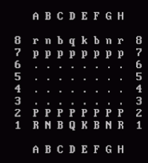

# 4 Задание. Практикума по программированию.    
## Тема задания «Шахматный симулятор».    
    
Количество баллов – 10 (требуется защита работы).   
Базовая часть – 3 баллы.   
Дополнительная часть – до 7 балов.   
Отсутствие защиты штрафуется 5 баллами.   
Нарушение дедлайна штрафуется 5 балами (минимальный количество баллов 1).   
    
__Дедлайн: 15.12.2022__

Методические рекомендации:     
Код пишется в IDE VS Code, Pycharm, replit.    
jupyther notebook – НЕ используем.    
    
Структура проекта.    
•	app.py – реализация программы.   
•	README.md – отчет к работе     
•	requirements.txt – список библиотек и версий.   
     
*Содержание app.py*.   
Оформление согласно стандарту PEP8 (https://netology-university.bitbucket.io/codestyle/python/).       
Документирование функций.   

*Содержание README.md.*   
	Наименование работы.       
	Кто выполнил: Студент, Группа.   
	Задание – полностью текст.  
	Скриншот или анимация выполнение программы    
     
Создание requirements.txt: pip freeze > requirements.txt.   
     
__Базовая часть:__.    
Реализовать программу, которая позволяет играть в шахматы на компьютере. Взаимодействие с программой производится через консоль (базовый вариант). Игровое поле изображается в виде 8 текстовых строк, плюс строки с буквенным обозначением столбцов (см. пример на Рис. 1) и перерисовывается при каждом изменении состояния поля. При запросе данных от пользователя программа сообщает, что ожидает от пользователя (например, позицию фигуры для следующего хода белыми; целевую позицию выбранной фигуры) и проверяет корректность ввода (допускаются только ходы соответствующие правилам шахмат; поддержка рокировки, сложных правил для пешек и проверки мата вынесена в отдельные пункты). Программа должна считать количество сделанных ходов. 
 
   
Рисунок 1 - Пример изображения шахматного поля в текстовом режиме.   

__Сама программа НЕ ходит:__ т.е. не пытается выполнить ходы за одну из сторон, а предоставляет поочередно вводить ходы за белых и черных.   

*Справка о шахматной нотации:*    
1.	Общая информация о шахматной нотации записи партий: https://ru.wikipedia.org/wiki/Шахматная_нотация 
2.	Партии в полной нотации: бесплатная база (для открытия партий нужно зарегистрироваться на ресурсе) записей партий в шахматной нотации (полной):  http://www.chessebook.com/openings.php?lan=ru&pa=pa (для получения файлов с записью партий копируйте текст понравившихся партий в текстовый файл, скопированный текст не подвергать дополнительному редактированию и сохранить в файл).
3.	Партии в сокращенной нотации берем из обсуждений на kasparovchess.crestbook.com, например, из этой ветки: http://kasparovchess.crestbook.com/threads/8210/ (для получения файлов с записью партий копируйте текст понравившихся партий, расположенных справа от блока с доской, в текстовый файл, скопированный текст не подвергать дополнительному редактированию (он во многих нюансах будет отличаться от партий с chessebook.com, так и должно быть) и сохранять файл).

__Дополнительные задания:__
1.	Реализовать чтение записи шахматной партии из выбранного пользователем файла в полной нотации. После чтения должна быть возможность двигаться вперед и назад по записи партии (с соответствующим изменением на поле). Должна быть возможность в выбранной позиции перейти из режима просмотра партии в обычный режим игры.
Протестировать не менее чем на 20 реальных партиях с сайта.
Баллы 2
2.	Реализовать чтение записи шахматной партии из выбранного пользователем файла в сокращенной нотации. После чтения должна быть возможность двигаться вперед и назад по записи партии (с соответствующим изменением на поле). Должна быть возможность в выбранной позиции перейти из режима просмотра партии в обычный режим игры.
Протестировать не менее чем на 20 реальных партиях с сайта.
Баллы 3
3.	Реализовать возможность записи разыгрываемой шахматной партии в текстовый файл в полной (сокращенной, если студент выполнял задание 2) нотации. Записать партию можно на любом ходу, с историей всей партии с самого начала. Записанная партия должна корректно воспроизводиться в режиме чтения записи партии.
Баллы 2
4.	Реализовать возможность «отката» ходов. С помощью специальной команды можно возвращаться на ход (или заданное количество ходов) назад вплоть до начала партии.
Баллы 1
5.	Реализовать функцию подсказки выбора новой позиции фигуры: после выбора фигуры для хода функция визуально на поле показывает поля доступные для хода или фигуры соперника, доступные для взятия, выбранной фигурой. 
Баллы 1
6.	Реализовать функцию подсказки угрожаемых фигур: она возвращает информацию о том, какие фигуры ходящего игрока сейчас находятся под боем (т.е. могут быть взяты соперником на следующий ход) и визуально выделяет их на поле. Функция отдельно указывает на наличие шаха королю.
Баллы 1
7.	Автоматически определять мат (правила определения: https://ru.wikipedia.org/wiki/Мат_(шахматы) ).
Баллы 2
8.	Реализовать поддержку выполнения рокировки по всем шахматным правилам (в базовой версии поддержка рокировки не обязательна). Правила рокировки см.: https://ru.wikipedia.org/wiki/Рокировка 
Баллы 1
9.	Реализовать поддержку для пешки сложных правил: «взятие на проходе» и замены на другух фигуру при достижении крайней горизонтали (в базовой версии их поддержка не обязательна, но возможность первого хода на одну или две горизонтали - обязательно). Подробнее о правилах см.: https://ru.wikipedia.org/wiki/Правила_шахмат .
Баллы 1
